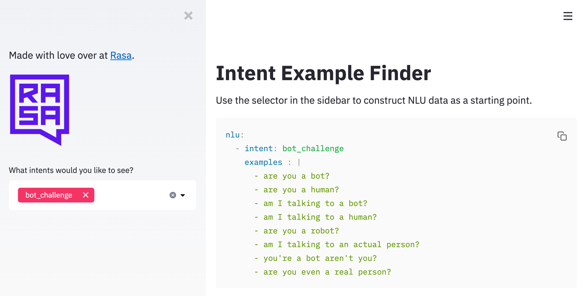

# NLU Training Data

Crowd-sourced training data for the development and testing of Rasa NLU models. 

If you're interested in grabbing some data feel free to check out our [live data fetching ui](https://share.streamlit.io/rasahq/nlu-training-data/main).

---

## About this repository 

This is an experiment with the goal of providing basic training data for developing chatbots, therefore, this repository is open for contributions!

We need your help to create an open source dataset to empower chatbot makers and conversational AI enthusiasts alike, and we very much appreciate your support in expanding the collection of data available to the community.

## How do I donate my training data?

Each folder should contain a list of multiple intents, consider if the set of training data you're contributing could fit within an existing folder before creating a new one.

### To contribute via pull request, follow these steps:

1. Create an issue describing the training data you would like to contribute. 

2. Create a new file with a folder title and a `NLU.md` file, or contribute to an existing folder.  

3. In the `NLU.md` file, format your training data using markdown, remove all entities (see [script](https://github.com/RasaHQ/NLU-training-data/tree/master/how-to-remove-entities)), title each section with the intent types and add a short description e.g.`intent:inform_rain <!--The user says that it is currently raining somewhere.-->` 

4. Update the `README.md` file, include a list of the intent types added. 

5. Create a pull request describing your changes. 

Your pull request will be reviewed by a maintainer, who will get back to you about any necessary changes or questions. You will also be asked to sign a [Contributor License Agreement](https://cla-assistant.io/RasaHQ/rasa).

## FAQs

### How should I label my intents?

Please always put the domain at the end of each intent. For example: `ask_transport`

### What do I do about multi-intent utterences? 

If you would like to contribute multi-intent utterences, please add a `+` to indicate an additional intent, for example: `affirm+ask_transport`

### What about training data that’s not in English? 

Currently, we are unable to evaluate the quality of all language contributions, and therefore, during the initial phase we can only accept English training data to the repository.
However, we understand that the Rasa community is a global one, and in the long-term we would like to find a solution for this in collaboration with the community. 

### Why do I need to remove entities from my training data? 

We would like to make the training data as easy as possible to adopt to new training models and annotating entities highly dependent on your bot’s purpose. Therefore, we will first focus on collecting training data that only includes intents.

To help you remove the annotated entities from your training data, you can run [this script](https://github.com/RasaHQ/NLU-training-data/blob/master/entity-removal-script.py). 

---  

## About Rasa

- **What does Rasa do? 🤔**
  [Check out our Website](https://rasa.com/)

- **I'm new to Rasa 😄**
  [Get Started with Rasa](https://rasa.com/docs/getting-started/)

- **I'd like to read the detailed docs 🤓**
  [Read The Docs](https://rasa.com/docs/)

- **I'm ready to install Rasa 🚀**
  [Installation](https://rasa.com/docs/rasa/user-guide/installation/)

- **I want to learn how to use Rasa 🚀**
  [Tutorial](https://rasa.com/docs/rasa/user-guide/rasa-tutorial/)

- **I have a question ❓**
  [Rasa Community Forum](https://forum.rasa.com/)

- **I would like to contribute 🤗**
  [How to Contribute](#how-to-contribute)
